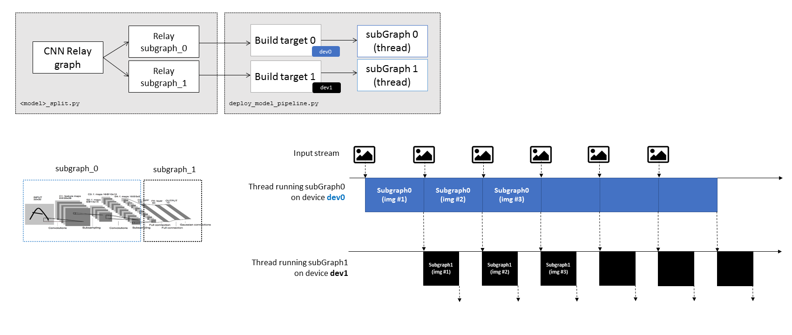

# TVM heterogeneous co-execution. Files for tuning, compiling and running CNN models

1. **``tune_network_<cuda/arm>_TX2local.py``**
 - Tune network using TVM Ansor targeting to GPU/CPU (to be locally executed on the platform) 
 - Example: ``python tune_network_arm_TX2local.py -m mobilenet --logfile mobilenet_tuned_cuda.json --layout NCHW`` 
 - Source: TVM documentation 

2. **``deploy_model.py``**
 - *Locally* compile and run model. Example: ``python deploy_model.py -m mobilenet -c 1000 --target 'cuda'``
 - *Remotely* compile and run model. Example: ``python deploy_model.py -m mobilenet --target 'llvm -mtriple=aarch64-linux-gnu' --remote --key remote_dev``
 - Model runtime *profiling*. Example: ``python deploy_model.py -m mobilenet -c 1000 --target 'cuda' --profile`` 
 - Compile and run *tuned* model. Example: ``python deploy_model.py -m mobilenet --target 'cuda' --logfile mobilenet_tuned_cuda.json`` 

3. **``deploy_model_pipeline.py``**
 - Locally compile and run model in a *pipeline scheme*, splitted into two separate partitions. 
 - Model partitions are defined in ``<model>_split.py`` in /tvm/python/tvm/relay/testing/ and accesed via ``get_network()`` in ``util.py`` (``--model`` argument)
 - Each partition is compiled targeting to the specified TVM device, e.g., GPU or CPU (``--target`` argument) 
 - Example: ``python deploy_model_pipeline.py -m mobilenet_split-23 -c 1000 --target 2,0 --logfile mobilenet_tuned_cuda.json,mobilenet_tuned_llvm.json``  
       - *model*: manually implemented network partitions. Use ``--model mobilenet_split-help`` to check options for implemented partition points. 
       - *target*: according to list provided by ``python deploy_model_pipeline.py -m model --target help`` 
 
